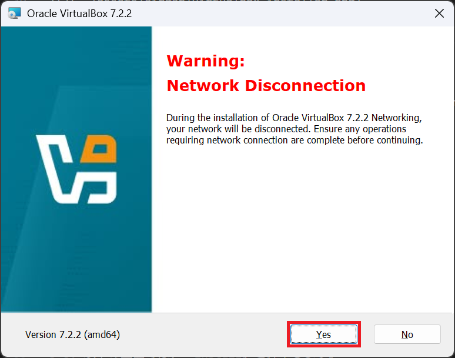
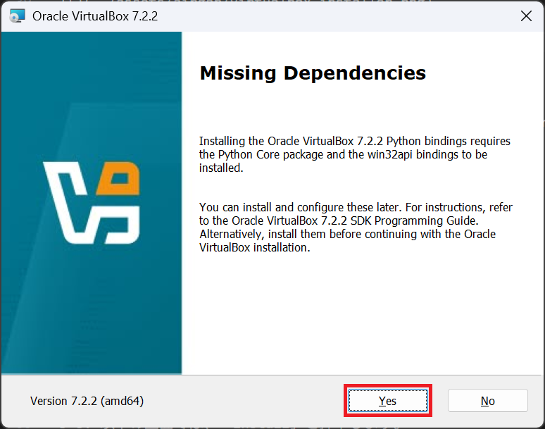
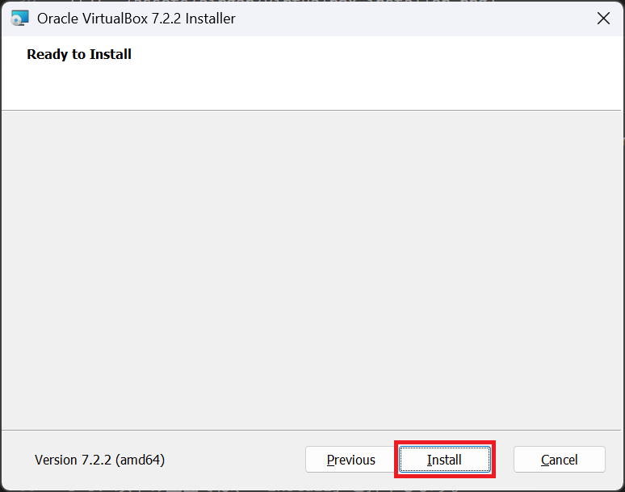
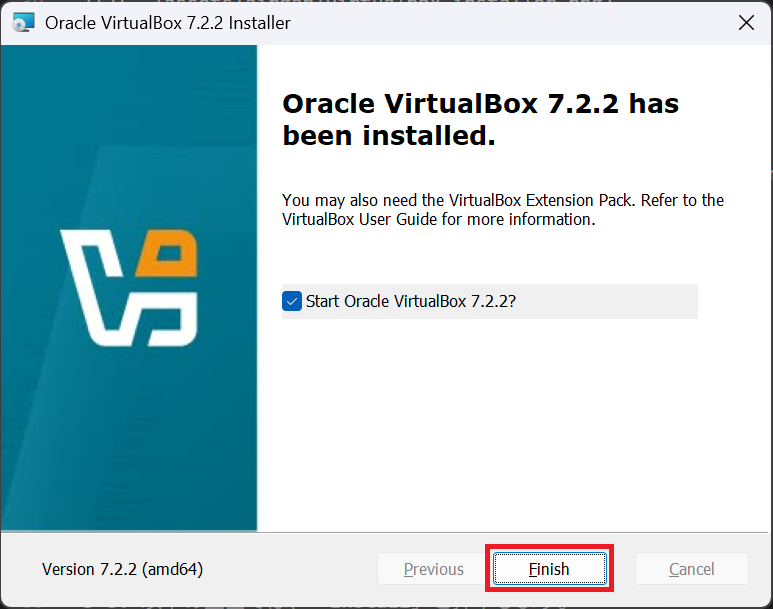
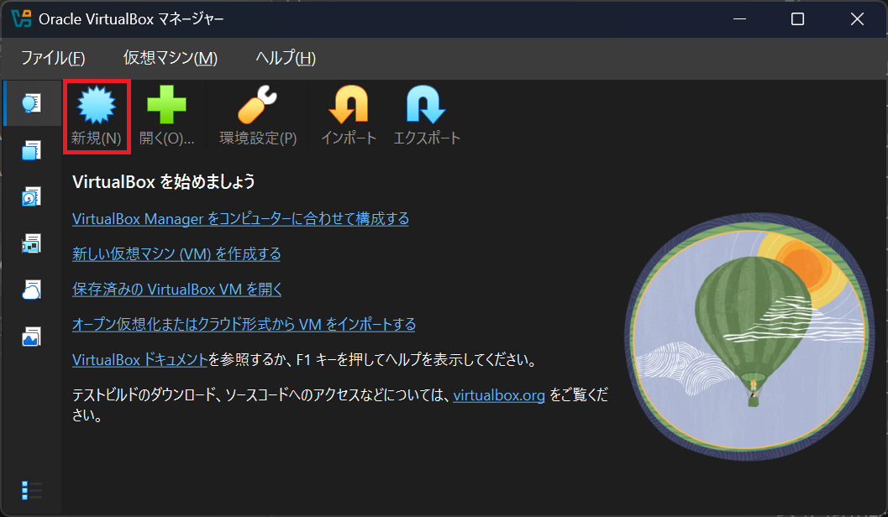
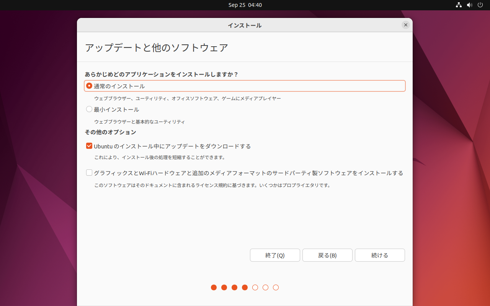

# WindowsでVirtualBox with ctoolの環境構築

## 1. Ubuntu の入手

- [Ubuntu 22.04.5 LTS の入手](https://releases.ubuntu.com/22.04/)

1-1. 以下の画像の赤く囲ったところを押下してダウンロードします。

| ファイル名 |
|-----------|
| ubuntu-22.04.5-desktop-amd64.iso |

## 2. VirtualBox の入手

- [Oracle VirtualBox 7.1.10 の入手](https://www.oracle.com/jp/virtualization/technologies/vm/downloads/virtualbox-downloads.html)

1-1. 以下の画像の赤く囲ったところを押下してダウンロードします。

| ファイル名 |
|-----------|
| VirtualBox-7.1.10-169112-Win.exe |

## 3. VirtualBox のインストール

3-1. ダウンロードしたVirtualBoxのインストーラーをダブルクリックし起動します。

3-2. 以下の画面が表示されたら、「Next >」を押下します。

3-3. 以下の画面では、「I accept the term in the License Agreement」にチェックをし、「Next >」を押下します。

3-4. 以下の画面では、「Next >」を押下します。

3-5. 以下の画面では、「Yes」を押下します。

3-6. 以下の画面では、「Yes」を押下します。

3-7. 以下の画面では、「Next >」を押下します。

3-8. 以下の画面では、「Install」を押下します。

3-9. 以下の画面では、次の画面に切り替わるまで待ちます。

3-10. 以下の画面では、「Finish」を押下します。

3-11. VirtualBox の管理画面が起動すれば、インストール完了です。

## 4. VirtualBox仮想マシンの作成

4-1. 以下の画像の赤く囲った「新規(N)」ボタンを押下し、仮想マシンの作成を開始します。

4-2. 仮想マシンの名前とOS

「仮想マシンの名前とOS」設定画面で、以下の表のように設定し「次へ(N)」を押下します。

| 項目                    | 指定値                                      |
|-------------------------|--------------------------------------------|
| 名前                    | 任意の仮想マシン名                           |
| ISO イメージ             | 1でダウンロードした Ubuntu ISO ファイルを指定 |
| 自動インストールをスキップ | チェックをする                             |

4-3. 仮想マシンのハードウェア

「ハードウェア」設定画面で、以下の表を参考に設定し「次へ(N)」を押下します。

| 項目          | 指定値       |
|---------------|-------------|
| メインメモリー | 4096 MB 以上 |
| プロセッサー数 | 2 CPU 以上   |

以下の画像では、PCに余裕があったため、各値を2倍に設定しています。

4-4. 仮想マシンの仮想ハードディスク

「仮想ハードディスク」設定画面で、ディスクサイズを50GBに設定し「次へ(N)」を押下します。

4-5. 仮想マシンの概要

「概要」画面で、仮想マシンの概要を確認し、「完了(F)」を押下します。

## 5. VirtualBox仮想マシンの環境設定

5-1. 作成した仮想マシン(今回は Airgap)を選択し、「設定」を押下します。

5-2. 

5-3.

5-4.

5-5.

## 6. Ubuntu のインストール

6-1.

6-2.

6-3.

6-4.

6-5.

6-6.

6-7.

6-8.

6-9.

6-10.

6-11.

6-12.

6-13.

6-14.

6-15.

6-16.

6-17.

6-18.

6-19.

6-20.

6-21.

## 7. Guest Addtions のインストール & 設定

7-1.

7-2.

7-3.

7-4.

