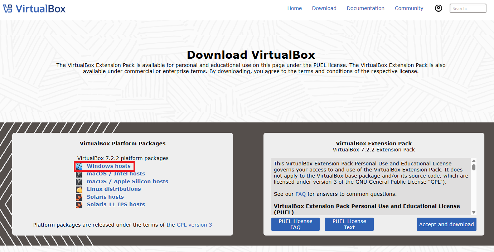
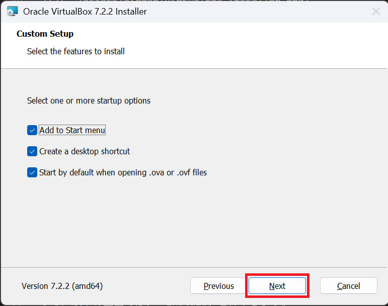
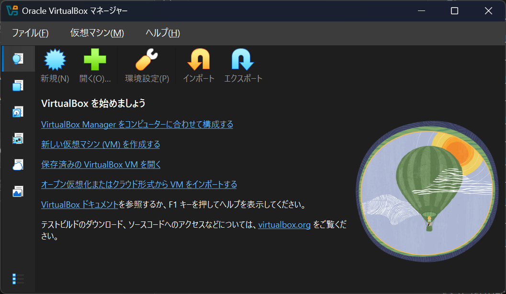
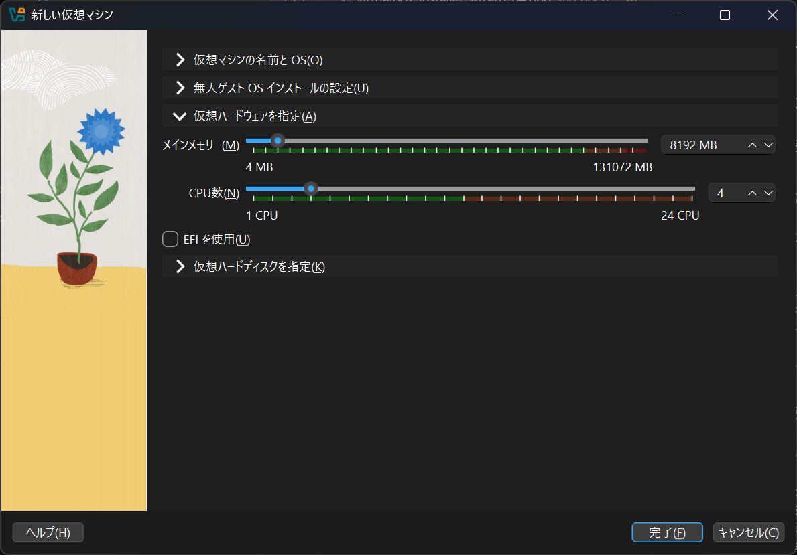
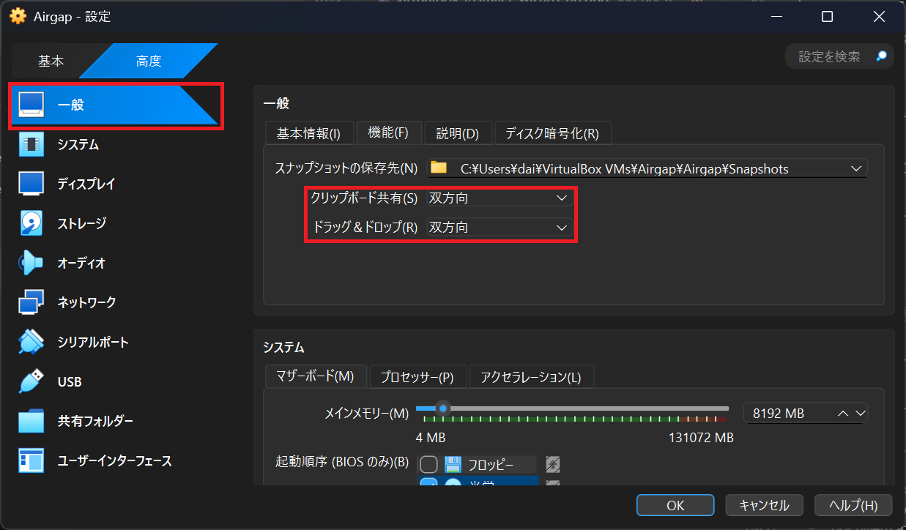
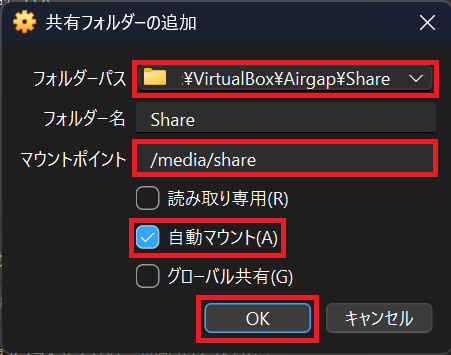
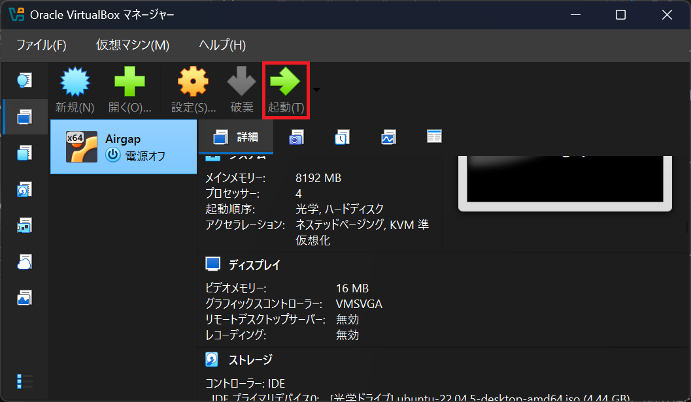

# WindowsでVirtualBox with ctoolの環境構築

## 1. Ubuntu の入手

- [Ubuntu 22.04.5 LTS の入手](https://releases.ubuntu.com/22.04/)

1-1. 以下の画像の赤く囲ったところを押下してダウンロードします。

| ファイル名 |
|-----------|
| ubuntu-22.04.5-desktop-amd64.iso |

## 2. VirtualBox の入手

- [Oracle VirtualBox 7.2.2 の入手](https://www.virtualbox.org/wiki/Downloads)

1-1. 以下の画像の赤く囲ったところを押下してダウンロードします。

| ファイル名 |
|-----------|
| VirtualBox-7.2.2-170484-Win.exe |

## 3. VirtualBox のインストール

3-1. ダウンロードしたVirtualBoxのインストーラーをダブルクリックし起動します。

3-2. 以下の画面が表示されたら、「Next >」を押下します。

3-3. 以下の画面では、「I accept the term in the License Agreement」にチェックをし、「Next >」を押下します。

3-4. 以下の画面では、「Next >」を押下します。

3-5. 以下の画面では、「Yes」を押下します。

3-6. 以下の画面では、「Yes」を押下します。

3-7. 以下の画面では、「Next >」を押下します。

3-8. 以下の画面では、「Install」を押下します。

3-9. 以下の画面では、次の画面に切り替わるまで待ちます。

3-10. 以下の画面では、「Finish」を押下します。

3-11. VirtualBox の管理画面が起動すれば、インストール完了です。

## 4. VirtualBox仮想マシンの作成

4-1. 以下の画像の赤く囲った「新規(N)」ボタンを押下し、仮想マシンの作成を開始します。

4-2. 仮想マシンの名前とOS

「仮想マシンの名前とOS」設定画面で、以下の表のように設定し「次へ(N)」を押下します。

| 項目                    | 指定値                                      |
|-------------------------|--------------------------------------------|
| VM名                    | 任意の仮想マシン名                           |
| ISO イメージ             | 1でダウンロードした Ubuntu ISO ファイルを指定 |
| 無人インストールを実行    | チェックを外す                              |

4-3. 仮想マシンのハードウェア

「ハードウェア」設定画面で、以下の表を参考に設定し「次へ(N)」を押下します。

| 項目          | 指定値       |
|---------------|-------------|
| メインメモリー | 4096 MB 以上 |
| プロセッサー数 | 2 CPU 以上   |

以下の画像では、PCに余裕があったため、各値を2倍に設定しています。

4-4. 仮想マシンの仮想ハードディスク

「仮想ハードディスク」設定画面で、ディスクサイズを50GBに設定し「次へ(N)」を押下します。

4-5. 仮想マシンの概要

「概要」画面で、仮想マシンの概要を確認し、「完了(F)」を押下します。

## 5. VirtualBox仮想マシン環境設定

5-1. 作成した仮想マシン(今回は Airgap)を選択し、「設定」を押下します。

5-2. 「一般」メニューを押下して、「クリップボード共有」と「ドラッグ&ドロップ」をどちらも「双方向」に変更します。

5-3.「システム」メニューを押下し、「フロッピー」のチェックを外し、「ポインティングデバイス」を「PS/2 マウス」に設定します。

5-4. 「共有フォルダー」メニューを押下し、右上の「新しい共有フォルダーを追加」ボタンを押下します。

5-5. 以下の表を参考に設定をし「OK」を押下します。

| 項目           | 設定値                                     |
|----------------|-------------------------------------------|
| フォルダーパス  | Windows 上に作成した任意のディレクトリを選択 |
| マウントポイント | /media/share                             |
| 自動マウント    | 自動マウント にチェックを入れる             |

## 6. Ubuntu のインストール

6-1. Oracle VirtualBox マネージャーの「起動」ボタンを押下して仮想マシンを起動します。

6-2. 少し待つと以下の画面が表示されますので、左のリストから「日本語」を選択してください。日本語を選択すると、UIが日本語に変わります。

6-3. 以下の画面で「Ubuntuをインストール」を押下してください。

6-4. 以下の画面では、「Japanese」「Japanese」を選択してください。USキーボードをご利用の方は、「キーボードレイアウトを検出」ボタンを押下してください。

6-5. 以下の画面では、「通常のインストール」「Ubuntu のインストール中にアップデートをダウンロードする」にチェックを入れてください。

6-6. 以下の画面では、「ディスクを削除してUbuntuをインストール」にチェックが入っている事を確認し、そのまま「インストール」を押下してください。

6-7. 以下の画面では、そのまま「続ける」を押下してください。

6-8. 以下の画面では、お住まいの地域を選択して、「続ける」を押下してください。

6-9. 以下の画面では、「あなたの名前」に「Airgap」と入力しました。そうすると、「コンピューターの名前」と「ユーザー名の入力」欄も自動的に入力されますので、後は「パスワードの入力」と「パスワードの確認」を入力して「続ける」を押下してください。

6-10. 以下の画像のようにインストールが始まります。

6-11. 以下の画面が表示されたら、インストールは完了です。指示通り「今すぐ再起動する」を押下してください。

6-12. この画面が表示されたら、Enterキーを押下してください。

6-13. この画面が表示されたら、ユーザー名を押下してください。

6-14. この画面が表示されたら、パスワードを入力し Enterキーを入力してください。

6-15. この画面では、「スキップ」を押下してください。

6-16. この画面では、「今回はスキップ」にチェックが入っている事を確認し「次へ」を押下してください。

6-17. この画面では、「いいえ、送信しません」にチェックが入っている事を確認し「次へ」を押下してください。

6-18. この画面では、「位置情報サービス」がOFFになっている事を確認し「次へ」を押下してください。

6-19. この画面で初期設定は完了です。「完了」を押下してこの画面を閉じてください。

## 7. Ubuntu アップデートについて

7-1. この画面では、「アップグレードしない」を押下してください。

7-2. この画面では、「今すぐインストールする」を押下してください。

7-3. ソフトウェアの更新がおこなわれますので、完了するまでお待ちください。

## 8. Guest Addtions のインストール & 設定

8-1. メニューの「デバイス」から「Guest Additions CD イメージを挿入...」を押下します。

8-2. 左のランチャーバーのCDのマークを押下し、「ファイル」アプリを起動し「autorun.sh」を右クリックし、「プログラムとして実行」を押下します。

8-3. パスワードを聞かれますのでパスワードを入力してください。

8-4. Guest Additionsのインストールが完了しますので、Enterキーを押して端末を閉じてください。

7-2.

7-3.

7-4.

