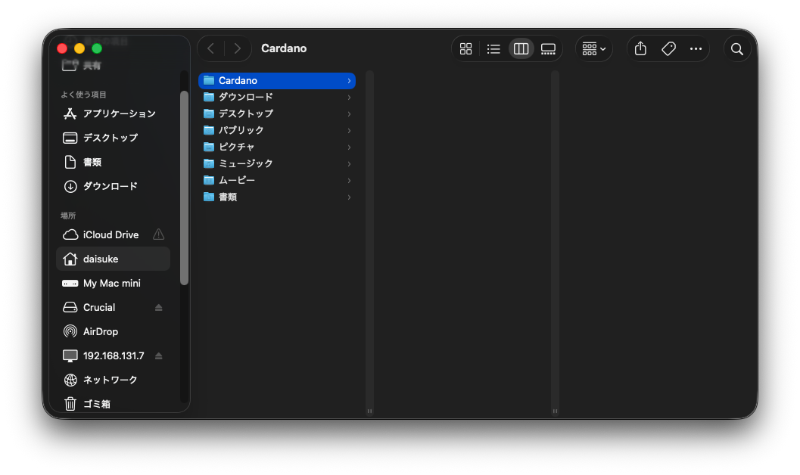
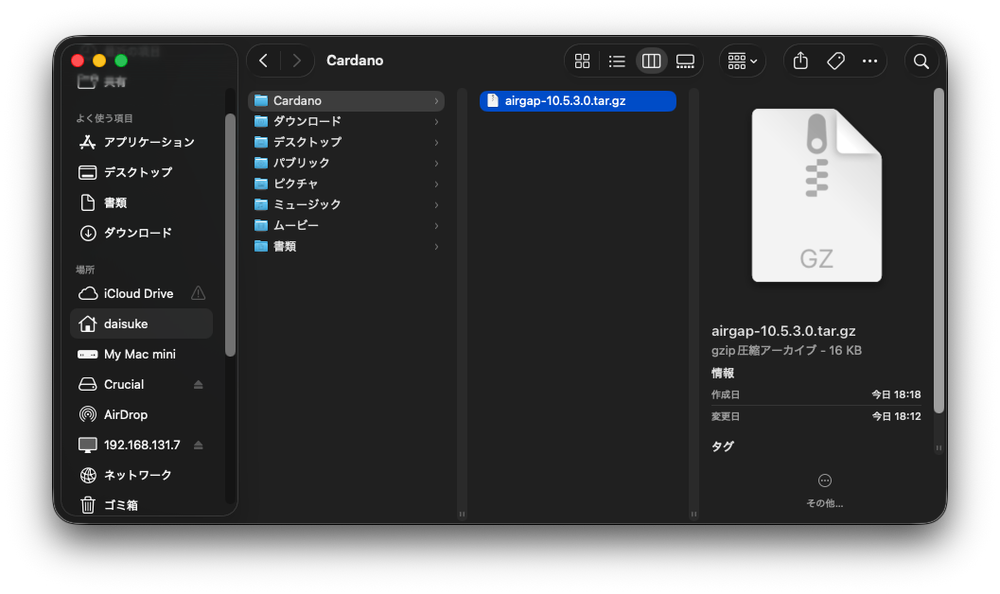
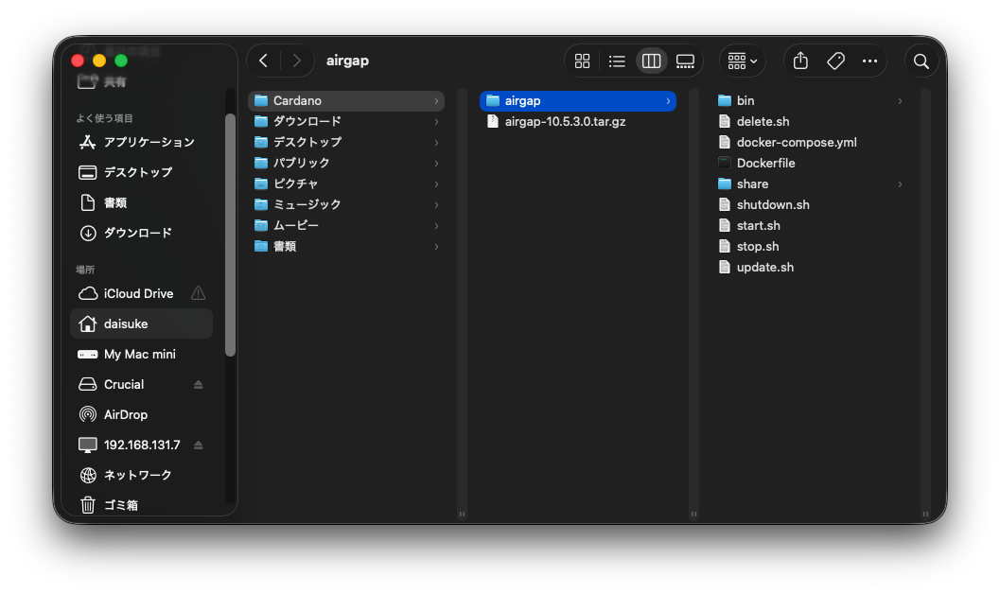
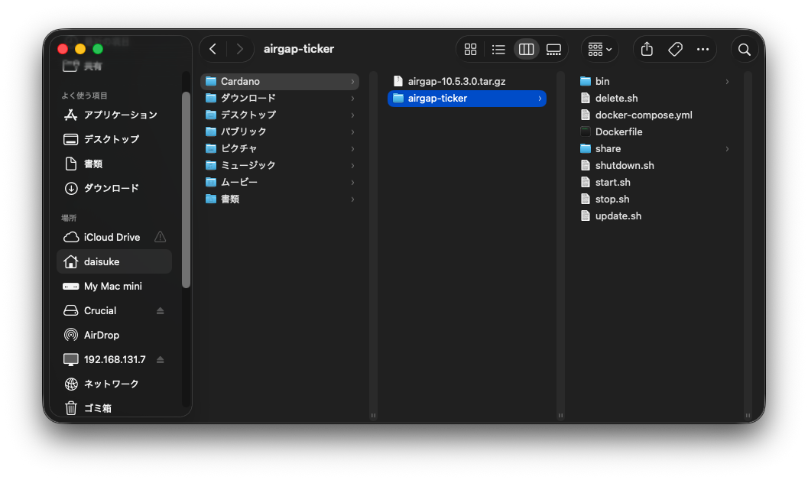
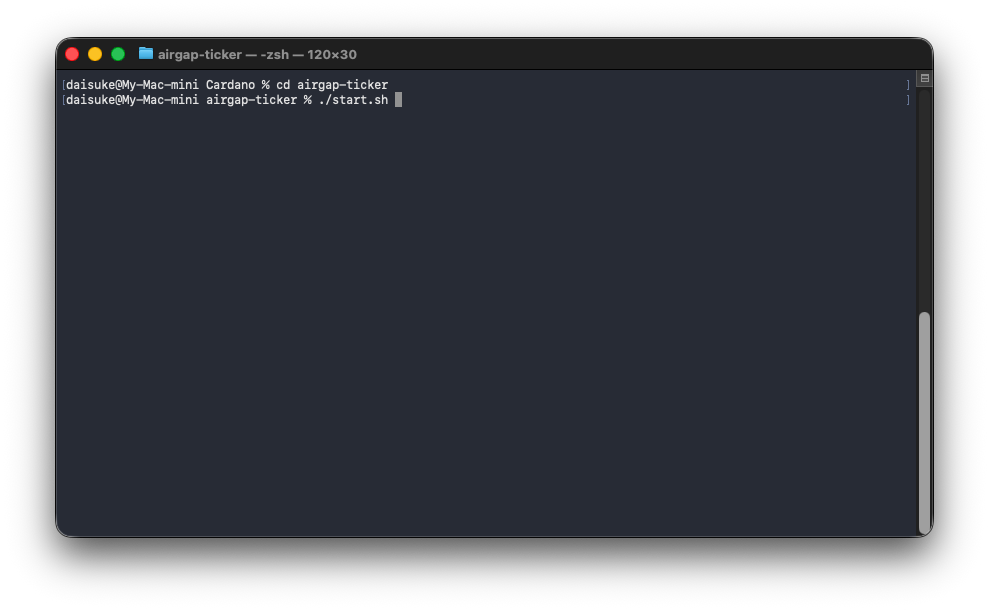
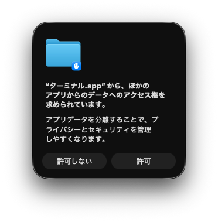
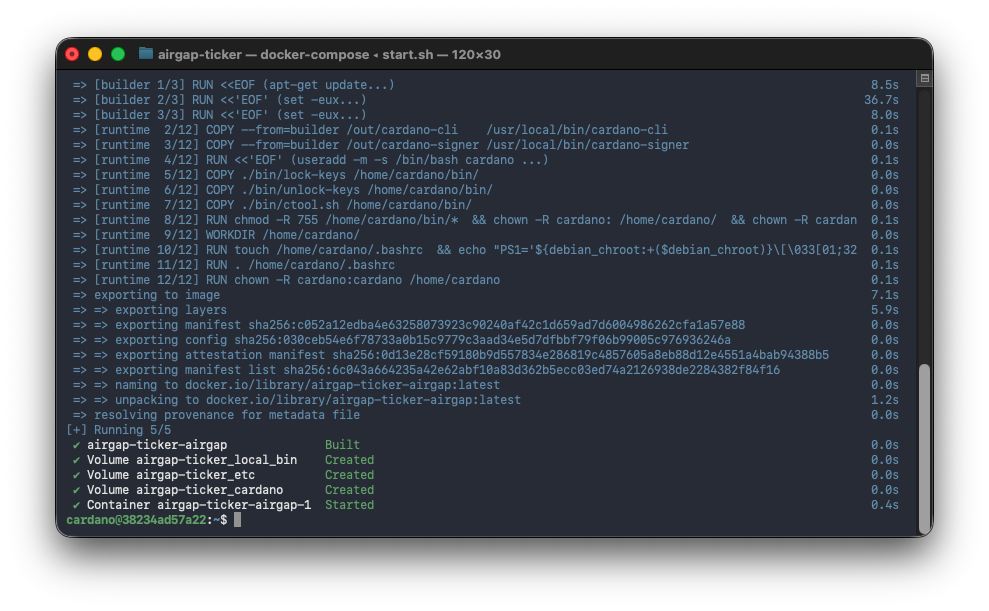
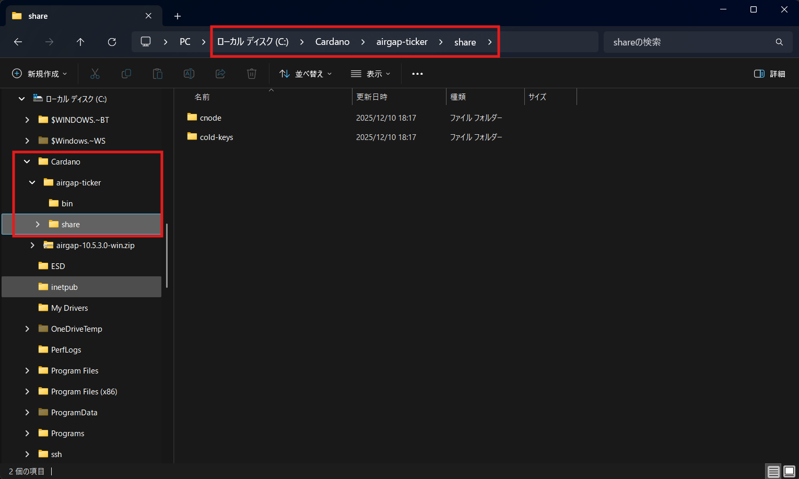

# Docker のセットアップ

## Docker Airgap の使い方

### Docker Airgap をダウンロードする

[GitHub Releases](https://github.com/spo-kissa/cardano-airgap/releases)
ページから環境に応じたファイルをダウンロードします。

| Windows                 | Mac / Linux            |
|-------------------------|------------------------|
| airgap-xx.x.x.x-win.zip | airgap-xx.x.x.x.tar.gz |

### Docker Airgap を初期設定する

=== "Windows の場合"

    1. Cドライブ直下に `Cardano` ディレクトリを作成します

    2. `Cardano` ディレクトリ内に先ほどダウンロードした `zip` ファイルをコピーまたは移動します

    3. `zip` ファイルを右クリックしメニューから `すべて展開...` を選択します

    

    4. `圧縮(ZIP形式)フォルダーの展開` ダイアログで展開先を `C:\Cardano` にして `展開` を選択します

    

    5. `airgap` ディレクトリが解凍されている事を確認します

    

    6. `airgap` ディレクトリの名称を `airgap-ticker` に変更します

        `ticker` の部分はご自身のプールのティッカー名に置き換えてください

    7. `airgap-ticker` ディレクトリを右クリックして `ターミナルで開く` を選択します

    

    8. 以下のコマンドを実行します

    ```bash
    .\start.bat
    ```

    9. プロンプトが `cardano@<randam>:~$` と表示されると、エアギャップの用意は完了です！

    

=== "Mac の場合"

    1. ターミナル アプリを起動し、以下のコマンドを実行します

    ```bash
    mkdir ~/Cardano
    cd ~/Cardano
    open .
    ```

    

    2. Finder が表示されたら、`Cardano` ディレクトリ内にダウンロードした `.tar.gz` ファイルを移動します

    

    3. `.tar.gz` ファイルをダブルクリックし解凍します。

    4. `airgap` というディレクトリが解凍されている事を確認します

    

    5. `airgap` ディレクトリを `airgap-ticker` に変更します

        `ticker` の部分はご自身のプールのティッカー名に置き換えてください

    

    6. ターミナル に戻り、以下のコマンドを実行します

    ```bash
    cd airgap-ticker
    ./start.sh
    ```

    

    ※ コマンドを実行後、以下のセキュリティアラートが表示される場合がありますので「許可」をしてください。

    

    7. プロンプトが `cardano@<randam>:~$` と表示されると、エアギャップの用意は完了です！

    

### Docker Airgap の特徴

1. Docker Airgap では Windows / Mac / Linux どの環境でも同じ操作性を提供します

1. cardano-cli コマンドが標準で付属しています

1. cardano-signer コマンドが標準で付属しています

1. 以上のコマンド類を簡単に扱うための `ctool` というツールが付属しています
    - ctool は gtool と上手く連携して動作するように作成されており、エアギャップでの作業効率を向上させます

### Docker Airgap の共有フォルダ

**Docker Airgap ではネットワークには繋がらないように設定されています。**

=== "Windows の場合"

    1. エアギャップ側の `/mnt/share/` ディレクトリと、Windows側の `airgap-ticker\share\` ディレクトリが共有ディレクトリとなり、ファイルやフォルダのやり取りがおこなえます。

    

=== "Mac の場合"

    1. エアギャップ側の `/mnt/share/` ディレクトリと、Mac側の `airgap-ticker/share/` ディレクトリが共有ディレクトリとなり、ファイルやフォルダのやり取りがおこなえます。

**`ctool` を使用するとこの共有ディレクトリを意識せずに各種操作がおこなえます！**

### Docker Airgap の終了のしかた

1. `exit` を実行すると、Docker Airgap からログアウト出来ます。

=== "Windows の場合"

    2. もう一度 `exit` を実行すると、ターミナル画面も閉じられます。

=== "Mac の場合"

    2. ターミナルの左上の赤い×ボタンをクリックしてターミナル画面を閉じます。
