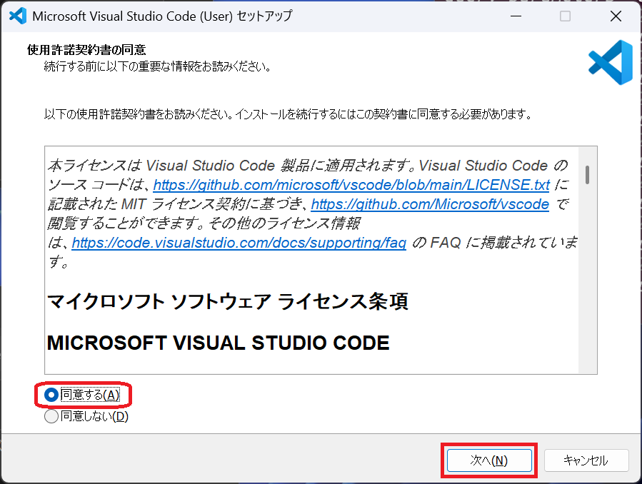

# マニュアルの書き方

## 1. Visual Studio Code の入手

1-1. Visual Studio Code を使用すると便利なので、以下のリンクから Visual Studio Code のサイトを開いてください。

[Visual Studio Code](https://code.visualstudio.com/)

1-2. 以下の画像の赤く囲った箇所を押下して、ダウンロードします。

| ファイル名 (2025/09/30時点)      |
|---------------------------------|
| VSCodeUserSetup-x64-1.104.2.exe |

1-3. ダウンロードしたファイルをダブルクリックして、インストールを行います。

## 2. Visual Studio Code のインストール

2-1. インストーラが起動したら、「同意する」にチェックを入れて、「次へ」を押下します。

2-2. お好きなオプションにチェックを入れて、「次へ」を押下します。(基本的にデフォルトのままで良いです)

2-3. オプションの確認をして、問題なければ「インストール」を押下します。

2-4. インストールが行われますので、少しだけお待ちください。

2-5. インストールが完了しました！「Visual Studio Codeを実行する」にチェックが入っている事を確認して、「完了」を押下します。

2-6. これが Visual Studio Code です！

