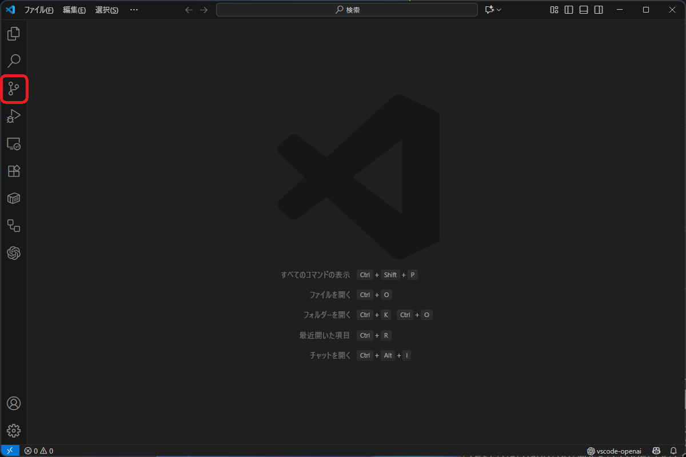

# マニュアルの書き方

## 1. リポジトリのクローン

1-1. 画像の赤く囲った箇所を押下して、「ソース管理」ツール画面を表示します。



1-2. 「リポジトリをクローンする」ボタンを押下します。


1-3. カーソルが当たった入力欄に以下のURLを入力し、Enterキーを押下します。

```
https://github.com/spo-kissa/docs.git
```


1-4. クローン先のフォルダーを選択し(ここでは「ドキュメント」フォルダを選択しています)、「リポジトリの宛先として選択」ボタンを押下します。


1-5. 以下の確認画面で「開く」を押下します。


1-6. 「エクスプローラー」の下にマニュアルを構成するファイルがダウンロードされています！


これで、リポジトリのクローンは完了です。
